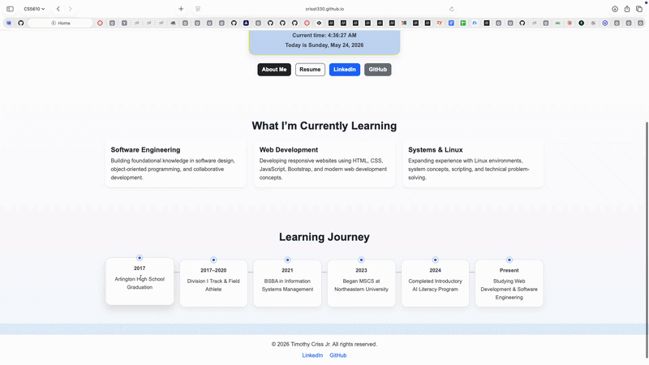

# Timothy Criss Personal Homepage

## Project Objective

The goal of Project 1 was to design and develop a professional personal website while demonstrating foundational front-end web development concepts, proficiency, and software engineering practices during the learning process of this course and assignment.

The application uses:
- HTML5 
- Bootstrap 5 responsive components
- Custom CSS styling
- Vanilla JavaScript
- DOM manipulation
- JavaScript event handling
- Responsive web designs
- Git and GitHub workflow practices

This project was created as a CS5610 Web Development assignment.

---

## Screenshot (Gif) of Webpages


---

## Live Deployment

GitHub Pages deployment:

[View Live Website](https://crisst330.github.io/Timothy-Criss-Personal-Homepage/)

---

## Features

- Responsive multi-page website structure using Bootstrap 5
- Professional homepage introduction and academic overview
- Dedicated About Me page with personal & professional background and interests
- Resume page displaying education, technical skills, coursework, honors, and certifications
- Responsive Bootstrap navigation bar for multi-page navigation
- Custom responsive card layouts and CSS styling
- External links to GitHub and LinkedIn profiles

---

## Creative Additions

This project includes several creative and user experience enhancements:

- Dynamic live greeting and clock card created with JavaScript
- The greeting automatically changes based on a visitor’s local time
    - Examples:
        - Good morning
        - Good afternoon
        - Good evening
- Live updating clock and current date display using JavaScript Date objects
- JavaScript DOM manipulation and automatic updates using `setInterval()`
- Custom “Learning Journey” timeline section showing academic and technical progression

---

## Tech Requirements

- HTML5
- CSS3
- JavaScript (ES6)
- Bootstrap 5
- Git
- GitHub
- GitHub Pages
- VS Code
- Node.js
- npm

---

## How to Install and Use

1. Clone the repository:

   ```bash
   git clone https://github.com/crisst330/Timothy-Criss-Personal-Homepage.git
   cd Timothy-Criss-Personal-Homepage
   ```

2. Install dependencies:

   ```bash
   npm install
   npm init -y
   ```

3. Run the local development server:

   ```bash
   npm reload -b
   ```

4. Open the local browser URL generated by the server.

5. Explore the pages:

   - `index.html` contains the homepage and JavaScript live clock feature.
   - `about-me.html` contains personal background information and interests.
   - `resume.html` contains education, technical skills, coursework, and certifications.
   - `styles/style.css` contains all custom CSS styling.
   - `js/main.js` contains the dynamic greeting and live clock functionality.

---

## Project Structure

```text
.
├── about-me.html
├── index.html
├── resume.html
├── js/
│   └── main.js
├── styles/
│   └── style.css
├── images/
│   ├── self-image.png
│   └── project-thumbnail.png
├── LICENSE
└── README.md
```

---

## Bootstrap Components Used

This project uses several Bootstrap 5 components, templates, and utility classes, including:

- Navbar
- Cards
- Buttons
- Containers
- Grid system
- Typography utilities
- Spacing utilities
- Responsive layout utilities


## Author

Created by [Timothy Criss Jr](https://github.com/crisst330).

---

## Class Reference Link

Created for CS5610 Web Development.

Course reference:

[CS5610 Web Development Course](https://johnguerra.co/classes/webDevelopment_online_summer_2026/)

---

## Video Demonstration

Add your project video demonstration link here before submitting:

```text
https://youtu.be/OJbLOV9sq0Q?si=Y-0sCvu97GoKmyf3
```

---

## Use of Generative AI

AI assistance was primarily used for:
- brainstorming website layout ideas
- improving wording and professional summaries
- explaining Bootstrap components and CSS concepts
- debugging HTML validation issues
- refining responsive layout structure
- generating README documentation structure based on class example from the course lecture from W3 modules
- explaining JavaScript concepts and DOM manipulation after reading and sharing ZyBook reference content from a web dev textbook I rent for this course

### GenAI Tool Information

- Tool Used: ChatGPT
- Model Used: GPT-5.5
- Provider: OpenAI
---

## Example Prompts Used

### Homepage Structure Prompt

```text
Help me brainstorm a simple but professional personal portfolio homepage for a Master’s student in Computer Science who does not yet have industry experience or major side projects. The design should focus on academic growth, technical interests, learning progression, and responsive Bootstrap layouts appropriate for an introductory web development course.
```

### Resume Page Prompt

```text
Help me convert my resume information into a clean multi-section HTML resume page using HTML, Bootstrap cards, badges, and responsive layouts while maintaining accessibility and readability.
```


### JavaScript Feature Prompt

```text
Help me brainstorn a list of beginner-friendly JavaScript features for my homepage that demonstrates event handling and DOM manipulation. I want the feature to feel interactive and professional without being overly complex and help me determine where in my ZyBook glossary I can practice these before implementing them into my project for understanding purposes.
```

### W3 Validator Debugging Prompt

```text
Review my HTML files and explain how to fix W3 Validator errors line by line and provide a brief explanation on what is being fixed, the lessons I must understand regarding the fix, and the key takeaways given that I am a masters student in CS learning this in order to become fluent in these technologies. I want to understand the fixes detail by detail. 
```

### README Documentation Prompt

```text
Help me create a professional README.md file structure for a responsive multi-page Bootstrap portfolio website using this base template README file I used in my self-assessment assignment. It must structure out sections such as: project objective, technologies used, creative additions, installation steps, project structure, and JavaScript functionality in a professional software engineering style.
```

---

## License

This project is licensed under the MIT License. See [LICENSE](./LICENSE) for details.